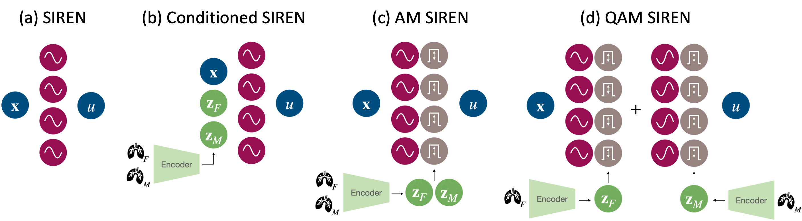

# Generalized INRs
Code for the paper *Towards generalised neural implicit representations for image registration* published at DGM4MICCAI 2023.

**Abstract:**
Neural implicit representations (NIRs) enable to parametrize the transformation for image registration in a continuous way. By design, these representations are image-pair-specific, meaning that for each signal a new multi-layer perceptron has to be trained. In this work, we investigate for the first time the potential of existent NIR generalisation methods for image registration and propose novel methods for the registration of a group of image pairs using NIRs. To exploit the generalisation potential of NIRs, we encode the fixed and moving image volumes to latent representations, which are then used to condition or modulate the NIR. Using ablation studies on a 3D benchmark dataset, we show that our methods are able to generalise to a set of image pairs with a performance comparable to pairwise registration using NIRs when trained on N = 10 and N = 120 datasets. Our results demonstrate the potential of generalised NIRs for 3D deformable image registration.

# Usage
    python scripts/generalization/run-general.py --exp=X --mode={train,test}

for config file with name L2R2022-T1-X

# Data
We have used data from the Learn2Reg challenge 2022 Task 1.

# Reference
V.A. Zimmer*, K. Hammernik*, Vasiliki Sideri-Lampretsa, Wenqi Huang, Anna Reithmeir, Daniel Rueckert, and Julia A. Schnabel: Towards generalised neural implicit representations for image registration. DGM4MICCAI 2023.

* Authors contributed equally

# Note
The code is heavily based on and modifies the repository https://github.com/MIAGroupUT/IDIR from the paper
Wolterink et al.: Implicit Neural Representations for Deformable Image Registration, MIDL 2022

# Contact:

veronika.zimmer@tum.de, vam.zimmer@gmail.com  
k.hammernik@tum.de